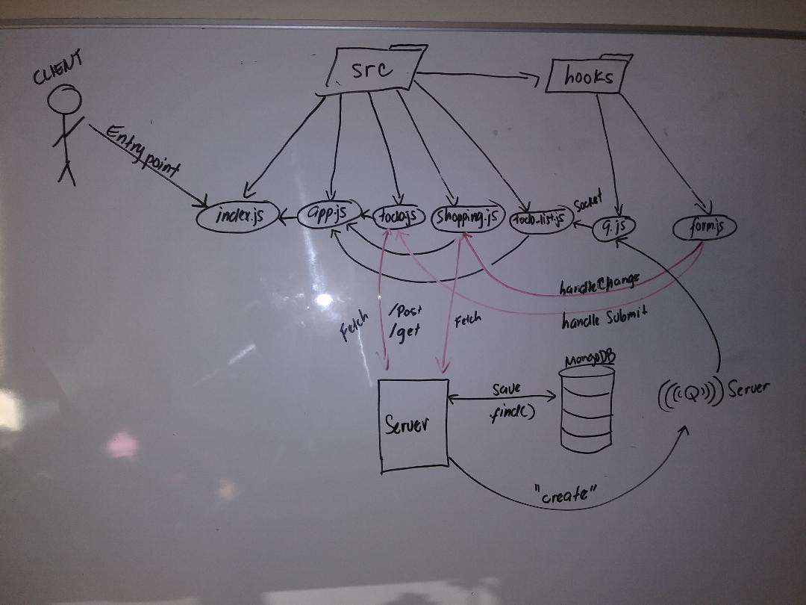

# LAB - 32

## Custom Hooks: Sockets and Fetch

### Author: Joseph Hangarter / Mobbed with Jon & class

### Links and Resources
* [Submission PR](https://github.com/401-advanced-javascriptnights-joseph/lab-32-Custom-Hooks-Sockets-and-Fetch/pull/4)
* [Netlify](https://jovial-hermann-38ecfd.netlify.com)

### Modules
### src folder
#### `index.js` - entry point
#### `app.js` - imported `shopping.js`, `todo.js`, & `todo-list.js`. Render to page; can swap from `shopping.js` or `todo.js`.
#### `shopping.js` - `fetch` POST to shopping API. Utilizing hooks (`handleChange` & `handleSubmit`) from `form.js`.
#### `todo.js` - `fetch` POST to shopping API. Utilizing hooks (`handleChange` & `handleSubmit`) from `form.js`.
#### `todo-list.js` - imported `q.js` returns created message as a `<ul>`.

### hooks folder
#### `form.js` - where `handleChange` & `handleSubmit` hook functions lives in. 
#### `q.js` - connects to `Q server` for subscribing & publishing.

##### Exported Values and Methods

##### `form.js`
###### `handleChange(event) -> string` - this will handle any change and set the values whenever there is an input as text, or picked as a category, date, asignee, or completed.
* `Hello World` (in input label) --> `Hello World` (output)
* Picked `Fun` in category dropdown --> `Fun`
* Picked `09/23/2019` as date --> `09/23/2019`

###### `handleSubmit(event) -> calling back values from handleChange`
* returns callback values in `handleChange` from `useForm`

##### `shopping.js`
###### `saveFormDataToServer(data) -> fetch post to API; stringified JSON`
* saving data to server in json format

##### `todo.js
###### `saveFormDataToServer(data) -> fetch post to API; stringified JSON`
* saving data to server in json format

##### `todo-list.js`
###### `handleNewItem(payload) -> creates a message, fetches from API, then results are stringified. `
* listens for any created subscriptions, and handles message

### Setup
#### `.env` requirements
* `REACT_APP_Q_SERVER` - socket queue
* `REACT_APP_API` - API for shopping (mongoDB)

#### Running the app
* `npm start`
* Endpoint: `https://api-js401.herokuapp.com/api/v1/todo`
  * Returns a JSON object with text that was inputted, and if other categories were entered or picked.
* Endpoint: `https://q-js401.herokuapp.com`
  * Returns and renders a `<ul>` on the page after listening for a subscription create with whatever was inputted as a todo.
  
#### UML

